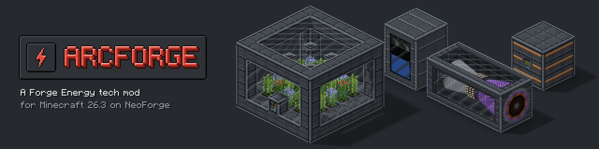

<p align="center">
  
</p>

<p align="center">
  A Forge Energy technology mod for Minecraft 26.3 on NeoForge.
</p>

## About

Arcforge adds machines that generate and use Forge Energy (FE). All machines expose energy, fluids
and items through NeoForge's standard capabilities, so they connect to cables, pipes and machines
from any other NeoForge mod that uses FE.

Every Arcforge machine, fluid tank and energy cell appears in the **Arcforge: Machines** creative tab.

## Machines

### Power and heat

```
coal / charcoal / coal block --[Combustion Plant]--> FE      (simple, least FE per coal)
coal / charcoal / coal block --[Firebox]--> heat (HU)            (up to 1,100°C)
lava (tank, pipes, nearby blocks) --[Geothermal Plant]--> heat   (up to 1,400°C)
heat --[Thermoelectric Plant]--> FE                              (hotter heat = more FE)
```

**Heat.** Heat machines store heat (HU) in a buffer. Their temperature rises from 20°C when the
buffer is empty to the machine's maximum when it's full. Heat leaves through faces set to **Heat**,
either into a touching machine's heat face (up to 100 HU/t, or a Solar Thermal Array's whole output) or
through thermodynamic conduits.
It only ever flows from a hotter machine into a colder one.

| Machine | Makes | Buffer | Max temp | Notes |
|---|---|---|---|---|
| Combustion Plant | 40 FE/t | 50,000 FE | — | Fuel burns at 2× furnace speed: 32,000 FE per coal |
| Firebox | 80 HU/t | 40,000 HU | 1,100°C | Fuel burns at 2× furnace speed: 64,000 HU per coal |
| Geothermal Plant | 80 HU/t from lava, plus passive | 60,000 HU | 1,400°C | 1 mB/t of lava: 80,000 HU per bucket |
| Thermoelectric Plant | FE from heat | 20,000 HU + 50,000 FE | 1,100°C | Takes up to 80 HU/t |

- **Fuel** for the Combustion Plant and Firebox is `#arcforge:combustion_fuel` (coal,
  charcoal, blocks of coal). Both pause while their buffer is full, keeping the rest of the burning item.
- **Geothermal Plant:** fill its 8,000 mB lava tank with lava buckets in the slot, by right-clicking
  with a bucket, or by piping lava into an input face. Touching lava source blocks add 40 HU/t each and
  magma blocks 16 HU/t each (all six sides count), even with an empty tank; they're never used up. It makes
  no FE itself.
  - **Self-sufficient power:** a plant with lava on five sides makes 200 HU/t at 1,400°C forever, with
    no fuel and no pumping. About 25 of them run a full 9-long Steam Turbine Array (Boiler plus
    Superheater). Move the heat with Tempered (200 HU/t) or Hardened (800 HU/t) thermodynamic
    conduits; a touching machine only takes 100 HU/t.
- **Thermoelectric Plant:** heat passes through it in proportion to how full its buffer is (up to
  80 HU/t when full), and becomes FE at an efficiency set by its temperature: 0% at 100°C,
  50% at 600°C and 100% at 1,100°C. It can't get hotter than what feeds it, so a Firebox gets it close to 100% (about 64,000 FE
  per coal), while a Geothermal Plant at 1,400°C drives it past 100%, up to 115%.
  It takes a few minutes to warm up.
- The Combustion and Thermoelectric Plants push up to 200 FE/t out of their energy faces.

**Solar Thermal Array** (Tempered tier). A 2x2 tower exactly 4 tall: three layers of Solar Thermal Array
Casings with one controller in the bottom layer, facing out of the tower, and four Solar Collectors on
top. Formed, it becomes one model: a tower base, a mast and a parabolic trough mirror whose receiver tube
glows from grey through dull red to orange as it heats. The trough follows the sun (and stows face down at
night and in thunderstorms), and the receiver takes in heat by it:

| Condition | Effect |
|---|---|
| Sun | sin(time of day): nothing at night, about 70% at 9:00, 100% at noon |
| Weather | rain or snow ×0.3, thunderstorm ×0.1 (stowed) |
| Tracking axis | the controller's facing: north or south ×1.0, east or west ×0.7 |
| Biome | hot (desert, badlands, savanna) ×1.2, cold ×0.85 |
| Collectors | each one that can't see the sky loses a quarter |

At clear noon on the north-south axis it makes 600 HU/t at 1,100°C. The temperature follows the same factors,
up to 1,100°C: in clear weather it's above 500°C (High-Pressure Steam) from about 7:45 to 16:15, and above
900°C (a Superheater Array, or Superheated Steam) from about 9:40 to 14:20. On the east-west axis (×0.7) it
tops out at about 780°C, too cool to superheat.
It holds 16,000 HU and gives heat out of its heat ports (a new tower has one on the bottom block behind
the controller), at its whole output even into a touching machine. A boiler it feeds only gets to 500°C
set to High-Pressure (see the Steam Boiler Array), since one array gives less heat than a boiler can boil. A buffer hotter than the sun now allows cools off over a few seconds. No sky, no heat:
it does nothing in the Nether or the End. Everything is configurable (`power.solarThermalArray`).

### Steelmaking and alloys

```
coal        --[Carbonizer]--> coal coke + 250 mB creosote   (600 ticks)
carbon dust --[Carbonizer]--> coal coke                     (300 ticks, no creosote)
metal + additive(s) + coal coke --[Arcforge Furnace]--> result + slag
```

**Arcforge Furnace.** Four inputs: the metal, two additive slots and coal coke, which is both its fuel and
its reagent (it keeps back what each smelt uses; a coke block counts as nine). Burning coke heats it towards
1,600°C, and a smelt only progresses above its recipe's minimum. A recipe's two additives can sit in either
additive slot, and an additive a recipe doesn't have needs its slot empty, so an alloy's metal never makes
steel by accident. Input ports send metals to the metal slot, coke to the coke slot and additives to the
additive slot already holding them (else the first empty one). Recipes are data-driven
(`arcforge:arcforge_smelting`: `metal`, optional `additive` and `additive_2`, `coke`, `result`, `byproduct`,
`time`, `min_temp`).

| Makes | Metal | Additives | Coke | Time | From |
|---|---|---|---|---|---|
| 1 Steel Ingot | 1 iron | — | 1 | 400 | 1,200°C |
| 4 Steel Ingot (+6 slag) | 4 iron | 1 fluorite crystal | 4 | 1,000 | 1,200°C |
| 2 Wrought Alloy | 2 iron | 1 gold | 1 | 400 | 1,200°C |
| 2 Tempered Alloy | 2 steel | 2 copper | 1 | 500 | 1,300°C |
| 2 Hardened Alloy | 2 steel | 2 amethyst shards + 1 nickel plate | 2 | 600 | 1,400°C |
| 2 Arcforged Alloy | 2 Hardened Alloy | 2 Carbon Fiber + 1 Arcite-Tungsten Composite | 2 | 800 | 1,500°C |

Each also gives 1 slag unless noted. **Tier alloys** are the material of every tiered block and item: conduits, cells,
tanks, cylinders and the portables are crafted from their tier's alloy, and each tier upgrades into the next
(the `arcforge:tier_upgrade` recipe keeps what it holds). The machine array casings need Tempered Alloy.
Crushing coal ore (2 carbon dust + a chance of a third) and carbonizing the dust is the high-yield coke route.
Carbon Fiber comes from the Distillation Array's pitch, so the top tier needs distillation.

### Steel tools and armour

Steel sits between iron and diamond, and mines at iron level (obsidian, ancient debris and Arcite still need
diamond). All of it repairs with Steel Ingots.

- **Tools** (sword, pickaxe, axe, shovel, hoe): vanilla recipes with Steel Ingots and sticks. 500 uses,
  7.0 mining speed.
- **Armour:** 2 / 7 / 5 / 2 armour and 1.0 toughness per piece.
- **Steel Hammer** (a pickaxe) and **Steel Excavator** (a shovel): three Steel Blocks on two Steel Rods (the
  Excavator takes one block). They break a 3×3 facing the side you hit, 1 durability per block, 1,500 uses, at
  70% of the speed.
  - The other 8 only break if the tool is good against them and they're no harder than the block you hit.
    Chests and other block entities, and unbreakable blocks, are skipped.
  - Each block fires its own break event, so claims and protection mods can stop it.
  - Sneak to break a single block. An outline shows what will break.

### Foundry Suit

Armour from Rock Wool, Slag Wool and Steel Plates, repaired with Rock Wool. Each piece cuts fire, campfire and
magma damage by 25%; the full set makes you immune to it and gives an 8-second **lava shield** (a bar over the
hotbar) that refills a minute after you leave the lava.

### Jetpacks

Worn in the chest slot, in Tempered, Hardened and Arcforged tiers (16,000 / 64,000 / 256,000 mB tanks). A
jetpack holds one gas at a time, filled in a Pressurized Cylinder's slots or by clicking a Gas Cartridge onto it
in your inventory.

| Fuel | Thrust | mB/t | Exhaust |
|---|---|---|---|
| Steam | 0.10 | 10 | steam puffs |
| High-Pressure Steam | 0.13 | 8 | steam puffs |
| Superheated Steam | 0.16 | 6 | steam puffs |
| Hydrogen | 0.20 | 4 | blue flame |

- **Modes** (the Jetpack Mode key, H by default): Normal thrusts while you hold jump and steers with the movement
  keys; Hover holds your height in the air (jump climbs, sneak sinks) for 1.5x the fuel; Off doesn't fire.
- A gauge left of the hotbar shows the fuel and mode. Flying clears fall damage, and the server won't kick you
  for it.
- **Armored Jetpack:** smith a Steel Chestplate onto a jetpack (with a Steel Plate as the template) for the
  chestplate's 7 armour and 1.0 toughness.
- Fuels are the data map `arcforge:jetpack_fuels`; tank sizes, climb speed and hover cost are in the config.

### Arc Drill and Arc Saw

FE-powered tools that never break, in three tiers: charge them in an Energy Cell or a Battery slot.

| | Tempered | Hardened | Arcforged |
|---|---|---|---|
| FE | 100,000 | 400,000 | 1,600,000 |
| Charge rate | 2,000 FE/t | 8,000 FE/t | 32,000 FE/t |
| Speed | 8 | 10 | 14 |
| Mines | diamond level | netherite level | netherite level |
| Module slots | 2 | 3 | 4 |

- The **Arc Drill** is a pickaxe and shovel (and makes paths); the **Arc Saw** is an axe (and strips logs), and
  fells whole trunks (sneak + right-click toggles Felling).
- **FE per block:** 50 x (1 + 0.25 x hardness), plus each active module's share: stone 69 FE, deepslate 88,
  obsidian 675. With too little FE they don't dig.
- **Modules** (right-click in the air to install; sneak + scroll to switch one on or off):
  - Area: a 3x3 (5x5 on Arcforged), with the Steel Hammer's rules, +25% FE;
  - Silk Touch (+100%) or Fortune I / II / III (+50% per level), never both on;
  - Vein Mining: up to 64 connected ore blocks (the Saw fells up to 256 logs), +25%;
  - Speed: digs 50% faster, +50%.
- They whir and buzz while cutting, and the drill's auger spins and the saw's chain runs in your hand.

### Ores

Seven ores generate in stone and deepslate (Silver, Nickel, Tungsten as wolframite ore, Fluorite, Bismuth,
Arcite and Halite). Each drops its raw item (Fortune works; Silk Touch drops the ore), and has a raw block and a storage
block. Raw items, ores and dusts smelt into the ingot or crystal (twice as fast in a blast furnace, and in the
Induction Furnace), and the Arc Crusher gives 2 dust per ore (+25%), 1 per raw item (+25%), 9 per raw block
and 1 per ingot. Arcite needs a diamond pickaxe and glows (ores 5, raw block 9, block 12). Every recipe
takes the common tags (`c:ingots/silver`, `c:gems/arcite`, ...), so other mods' silver works too.

| Ore | Veins / chunk | Vein size | Height | Used for |
|---|---|---|---|---|
| Silver | 8 | 9 | -32 to 64 (peaks mid) | batteries, trough mirrors |
| Nickel | 6 | 8 | -64 to 16 (peaks mid) | Invar, Hardened Alloy, turbine casings |
| Fluorite | 8 | 8 | -16 to 48 | Pressure Glass, steel flux |
| Bismuth | 8 | 8 | 0 to 56 | thermocouples |
| Tungsten | 6 | 6 | -64 to -16 | heating coils, the Arcforged composite |
| Arcite | 4 | 5 | -64 to -40 | Arcforged conduits and upgrades |
| Halite | 1 bed in 4 chunks | flat beds, radius 11 | -32 to 40 | Salt (Rock Salt crushes into 2) |

**Halite** is different: it forms wide, flat beds rather than veins, one layer thick, and three layers thick under
deserts and oceans (`haliteBeds`). It drops Rock Salt, which doesn't smelt; the Arc Crusher grinds it into Salt.

**Invar**: 2 iron dust + 1 nickel dust make 3 invar dust, which smelts into invar ingots. **Plates** (silver,
nickel, tungsten, invar) come from the Metal Press. **Components**: the Tungsten Heating Coil (Induction
Furnace and its array), the Thermocouple (Thermoelectric Plant and its upgrade) and the Arcite-Tungsten
Composite (1 tungsten plate + 2 arcite crystals, for Arcforged Alloy). Each ore's generation is set in the
`ores` config (and all but arcite can be turned off); turning one off keeps its items and recipes.

### Crushing

**Arc Crusher.** Crushes ores and materials into dusts with FE: 20 FE/t for 200 ticks (4,000 FE an
operation), with a bonus output rolled once per operation. It stores 20,000 FE and takes up to
200 FE/t. Raw iron gives 1 iron dust (plus a 25% bonus), iron ore 2, ingots 1, and raw-ore blocks 9.
Coal and charcoal give carbon dust, a furnace fuel (half a coal). Iron, copper, gold, ancient debris
and quartz dust smelt back (twice as fast in a blast furnace). Recipes are data-driven
(`arcforge:crushing`).

**Arc Crushing Array.** Place 27 Arc Crushing Array Casings as a solid 3x3x3 cube. It forms into one
machine facing the player who completed it (turn it with the wrench), and any casing opens its GUI.
Three lanes crush in parallel, twice as fast as the Arc Crusher and for 60% less FE an operation
(16 FE/t per working lane), and ore recipes give **double** the main output (raw iron gives 2 dust, iron
ore 4); ingots, gems and blocks are not doubled. It stores 100,000 FE and takes up to 1,000 FE/t.
It does IO through its ports (see Multiblock ports): a new one has an input in the middle of the top,
an output in the middle of the bottom and energy in the middle of the back; input ports feed the lane
holding the fewest items. Breaking any casing reverts it to loose casings; the contents stay in the centre casing.

### Pressing

**Dies.** A Plate Die, Gear Die or Rod Die goes in a press's die slot and decides what it makes. Dies
don't stack and are never used up, and only players can put them in or take them out: hoppers and
pipes never touch the die slot.

**Metal Press.** Presses steel ingots into parts with FE: 20 FE/t for 100 ticks (2,000 FE an
operation). A plate die makes 1 Steel Plate from 1 ingot, a gear die 1 Steel Gear from 4, a rod die 2
Steel Rods from 1. With no die it reads "No die"; taking the die out mid-operation starts it over. It
stores 20,000 FE and takes up to 200 FE/t. Automation only feeds it what its die presses. Recipes are
data-driven (`arcforge:pressing`), so other metals can add their own.

**Metal Pressing Array.** Place 27 Metal Pressing Array Casings as a solid 3x3x3 cube; it forms like
the Arc Crushing Array. Three lanes press in parallel, each with its own die, so plates, gears and rods
can run side by side. Each lane is twice as fast as the Metal Press and uses 60% less FE an operation
(16 FE/t per working lane). It stores 100,000 FE and takes up to 1,000 FE/t. Input faces feed a lane
whose die presses the item (the one holding the fewest first) and refuse anything no lane can use.

### Steam

**Gases.** Steam comes in three grades, each its own gas: Steam, High-Pressure Steam and Superheated
Steam. Exhaust Steam, Hydrogen and Oxygen are gases too. Gases are fluids lighter than air (or tagged `#arcforge:gases`). They travel only in Pressurized
Conduits and Pressurized Cylinders, which carry nothing else; Fluid Conduits and Fluid Tanks refuse
them. A tank or network holds one gas at a time.

**Pressurized Conduits** move 400 / 1,600 / 6,400 / 25,600 mB/t (twice a fluid conduit) and hold
2,000 mB each; they glow in the colour of the gas while they hold or move it. **Pressurized Cylinders** hold 64,000 / 256,000 / 1,024,000 /
4,096,000 mB, keep their gas when broken, and show their fill on a gauge (and to comparators). Their GUI's
top slot empties a Gas Cartridge into the cylinder and the bottom one fills it.

**Electric Pump.** Pumps the fluid source directly below it: a bucket every 20 ticks for 10 FE/t. The
source is removed, except water with two or more water sources beside it, which is infinite. It
pushes up to 1,000 mB/t out of its top. Takes Speed and Energy upgrades. On water in an ocean or beach
biome it pumps Seawater instead (for the Thermal Evaporator Array).

**Steam Boiler Array.** Boils water into steam with heat. It is a 3x3 tower, 3 to 7 blocks tall, of
Steam Boiler Array Casings and Pressure Glass, hollow in the middle.

- Only the 8 corners must be casings, so whole walls can be windows, and the water and steam show
  through them.
- The steam grade depends on its temperature:
  - Steam from 100°C (8 HU/mB);
  - High-Pressure from 500°C (12 HU/mB);
  - Superheated from 900°C (16 HU/mB).
- Per block of height it holds 100,000 HU, uses up to 600 HU/t, and has 16,000 mB tanks.
- A full-height (7) boiler boils up to 4,200 HU/t. That is about 350 mB/t of High-Pressure Steam,
  enough for a full-length Steam Turbine Array.

Its **pressure** (a tab in its GUI) picks the grade:
- **Auto** boils all the heat above 100°C. Fed more heat than it uses, it climbs toward its heat
  source's temperature and makes better steam. Underfed, it holds at 100°C making plain Steam.
- **Steam**, **High-Pressure** or **Superheated** heats without boiling until the boiler reaches that
  grade's temperature, then boils only the heat above it. It holds there, making that grade at whatever
  rate its heat comes in. So a slow source such as a Solar Thermal Array can still make High-Pressure
  Steam.

Cooling into a lower grade turns the steam it holds into that grade.

**Steam Turbine Array.** A 3x3 tube 3 to 9 long along either horizontal axis, built the same way. It
takes up to 40 mB/t per block of length at 10 / 18 / 28 FE per mB (a 9-long array on Superheated makes
10,080 FE/t). Its rotor spins up over a few seconds when steam flows, and output rises with it; it
coasts down when the steam stops. Its speed follows the power in the steam (flow times FE per mB), so a
higher grade spins it faster: full speed is a full flow of Superheated Steam. A new one has an energy port on its generator end and a steam port on
its bearing end. Heavy Oil in its 4,000 mB lubricant tank adds 8% to its output and doubles its spin-up, using 1 mB every 20 ticks per 3
blocks of length.

Spent steam vents, unless you give it an **Exhaust** port with the Wrench. With an Exhaust port, spent
steam leaves as **Exhaust Steam**, a gas only a Condenser Array can use. While the exhaust drains (its
tank isn't full), the turbine makes 10% more FE, on top of the lubricant bonus.

**Gas Turbine Array** (Hardened). A 3x3 tube 5 to 9 long along either horizontal axis, built like the Steam
Turbine Array (Pressure Glass windows allowed, but the middle of each end must be a casing). It burns fuel
straight to FE.

- **Intake and exhaust.** The end with air in front of its middle is the intake (the west or north end if
  both are open); the other is the exhaust. Block the intake and it shuts down. The intake's middle can't
  hold a port.
- **Fuel.** Any `arcforge:burner_fuels` fuel not marked `"gas_turbine": false`: Naphtha, Light Oil, Ethanol
  and Hydrogen (Heavy Oil and Creosote are refused). 8,000 mB of tank per block of length, one fuel at a time;
  liquids through fluid conduits, Hydrogen through Pressurized Conduits.
- **Output.** It burns up to 560 HU/t per block of length, at 1.5 FE per HU times the fuel's burn temperature
  over 1,200°C (at most 1):

  | Fuel | FE/mB | 9-long max FE/t | mB/t (9-long) |
  |---|---|---|---|
  | Naphtha | 600 | 7,560 | 12.6 |
  | Light Oil | 312.5 | 6,300 | 20.2 |
  | Ethanol | 337.5 | 5,670 | 16.8 |
  | Hydrogen | 90 | 7,560 | 84 |

- **Throttle.** In the **Throttle** redstone mode the signal strength sets the fuel burned (signal 5 burns a
  third); the other modes run it flat out.
- **Starting and stopping.** It ignites for a second before it burns. Running out of fuel is a flameout, and
  it waits a second before it relights. The rotor spools up in about 1.5 s (faster with Heavy Oil
  lubricant, which also adds 8%) and coasts down over about 4 s; output follows the rotor.
- **Exhaust heat.** A quarter of the fuel's heat leaves at half its burn temperature (Naphtha: 600°C) through
  Heat ports, e.g. into a Steam Boiler Array's Heat port for High-Pressure Steam: about 1.94× the FE of the
  burner-and-boiler route in all. With nowhere to go, it vents as a heat haze.
- A new one has an energy port on the bottom-left block of the intake end, a heat port in the middle of the
  exhaust end, and a fuel port under the middle of its length.

**Superheater Array.** A solid 3x3x3 cube of Superheater Array Casings (Hardened tier). It forms like
the Arc Crushing Array.

- It takes steam and heat in, and sends the next grade out.
- **Cost per mB:**
  - Steam → High-Pressure: 3 HU;
  - High-Pressure → Superheated: 3 HU;
  - Steam → Superheated: 6 HU.
- **Why use one:** boiling plain Steam (8 HU per mB) and superheating it (6) costs 14 HU per mB of Superheated
  Steam, against 16 to boil it directly. Only the superheater needs 900°C heat, so the boiler can run on any
  heat above 100°C.
- Its own heat must be at least the target grade's temperature (500°C / 900°C). Below that, steam
  passes through unchanged.
- **Pressure tab:**
  - **Auto** makes the best grade its heat allows.
  - **High-Pressure** and **Superheated** make only that grade.
- It uses up to 2,000 HU/t and has separate 16,000 mB tanks for steam in and steam out.
- A new one has a steam-in, a steam-out and a heat port.

**Condenser Array.** A solid 3x3x3 cube of Condenser Array Casings (Tempered tier). It turns Exhaust
Steam back into water, 1:1.

- It condenses 120 mB/t in open air.
- Blocks touching its outer faces add to that:
  - each water source: 20;
  - each ice: 30;
  - each packed ice: 40;
  - each blue ice: 60.
- Cold biomes condense ×1.25 and the Nether ×0.5, up to 400 mB/t.
- A new one has an exhaust-in and a water-out port.
- Boiler → turbine → condenser → back to the boiler's water port is a closed loop. The ports push on
  their own, so it runs without a pump.

### Distillation

```
creosote + heat (+ steam) --[Distillation Array]--> Naphtha, Light Oil, Heavy Oil, Pitch
pitch --[Fiberizer, 1,000°C]--> Carbon Fiber --> Arcforged Alloy
8 gravel + 1 pitch --> 8 Asphalt
```

**Distillation Array.** A solid 2x2 column exactly 4, 6 or 8 tall of Distillation Array Casings and Tray
Level Casings with one Distillation Array Controller (Hardened tier). The controller and the trays can't
be in the top or bottom layer; the controller's display is the front. Formed, the column reads as one
block, and its tray levels are glass: each shows its steel tray, the fraction pooled on it (as deep as its
tank is full) and vapour rising while it runs. It distils
1,000 mB batches of creosote with heat, at 4,000 HU a batch and only at 350°C or hotter:

| Height | Per 1,000 mB of creosote | Feed | Heat |
|---|---|---|---|
| 4 | 250 Naphtha, 2 Pitch | 10 mB/t | 40 HU/t |
| 6 | 250 Naphtha, 450 Heavy Oil, 1 Pitch | 15 mB/t | 60 HU/t |
| 8 | 250 Naphtha, 300 Light Oil, 300 Heavy Oil, 1 Pitch | 20 mB/t | 80 HU/t |

It holds 40,000 HU per 4 blocks of height (up to 1,400°C), 16,000 mB of creosote, 8,000 mB of steam and
8,000 mB of each product, and stops when a product it makes is full. **Steam stripping:** steam in its
steam tank raises each batch's Naphtha by the grade (Steam +15%, High-Pressure +30%, Superheated +50%), out
of the Heavy Oil (a straight bonus at 4 high), using 100 mB a batch. Its ports take the modes Input
(creosote), Steam, Heat, Naphtha, Light Oil, Heavy Oil and Pitch, with auto-eject; a new column has heat
underneath, feed on the left, Naphtha on top, Heavy Oil on the right and Pitch at the back. Recipes are data-driven
(`arcforge:distilling`: `input`, `heat`, `min_temp`, `by_height`, `item_output`, `steam_stripping`).

**Fuel Burner.** Burns liquid fuels into heat, but never hotter than the fuel's burn temperature (the
optional `burn_temperature` of the `arcforge:burner_fuels` data map; without it, the burner's 1,400°C):

| Fuel | HU/mB | mB/t | HU/t | Burns at |
|---|---|---|---|---|
| Creosote | 120 | 0.5 | 60 | 850°C |
| Naphtha | 400 | 0.5 | 200 | 1,200°C |
| Light Oil | 250 | 0.5 | 125 | 1,000°C |
| Heavy Oil | 200 | 0.25 | 50 | 750°C |
| Hydrogen (gas) | 60 | 1.0 | 60 | 1,400°C |
| Ethanol | 300 | 0.5 | 150 | 900°C |

Superheated Steam needs a 900°C boiler, so Naphtha is the fuel that makes it without a Geothermal Plant.
Naphtha also catches fire in the world. Hydrogen comes through Pressurized Conduits (they connect to the burner's
input faces), Cylinders or Gas Cartridges. **Pitch** is a long-burning furnace fuel (12 items) and spins into
Carbon Fiber. **Asphalt** (and its slab and stairs) speeds up walking, running and riding by about 30%.

### Electrolysis

```
100 mB water --[Electrolyzer]--> 200 mB Hydrogen + 100 mB Oxygen   (120,000 FE)
100 mB Brine --[Electrolyzer]--> 50 mB Hydrogen + 50 mB Chlorine + 100 mB Lye   (60,000 FE)
100 mB Light Oil + 50 mB Hydrogen --[Chemical Reactor]--> 2 Plastic Sheet
100 mB Ethanol + 5 mB Sulfuric Acid --[Chemical Reactor]--> 60 mB Ethylene + 40 mB Water (by-product tank)
120 mB Ethylene --[Chemical Reactor]--> 2 Plastic Sheet (bio-polyethylene)
60 mB Ethylene + 60 mB Chlorine --[Chemical Reactor]--> 2 PVC Sheet
```

**Electrolyzer** (Tempered). Splits water into Hydrogen and Oxygen with FE: 1,200 FE per mB of water (600
per mB of hydrogen) at 400 FE/t. Water goes in through Input faces (the top by default); Hydrogen and Oxygen
leave through their own face modes (left and right by default), pushed every tick into Pressurized Conduits,
Cylinders or anything else that takes gas. A Gas Cartridge fills from its hydrogen first, then its oxygen. It
has 8,000 mB of water and 16,000 mB of each gas, and takes Speed and Energy upgrades. A full gas tank stops
it; switch on the vent under that tank in its GUI and the gas that doesn't fit is released instead. Recipes are data-driven
(`arcforge:electrolyzing`: `input` with `fluid` or `tag` and `amount`, `primary`, optional `secondary` and
`energy`, optional liquid `tertiary`); the primary output fills the hydrogen tank, the secondary the oxygen tank (it
carries Chlorine too) and the tertiary its 8,000 mB liquid tank, which empties through Output faces (the bottom by
default).

**Hydrogen is a battery, not a power source.** Burnt in a Fuel Burner it gives 60 HU per mB at up to 1,400°C.
The Electrolyzer never charges less than 1.25× (`balanceSafetyFactor`) the most FE the best heat-to-FE setup
could get back from what it makes, worked out from the live config and data maps (every Heat upgrade in the
burner, then the better of a fully carded Thermoelectric Plant and a Superheated boiler into a lubricated,
exhausting turbine). By default that floor is 354 FE per mB of hydrogen, reached at the fourth Energy upgrade.

**Oxygen** (from the Electrolyzer or the Air Separator) speeds up the Arcforge Furnace: give it an Oxygen port with the Wrench and pipe oxygen in. A smelt
that starts with 50 mB in the furnace's 4,000 mB tank uses it and runs 1.5× as fast (config
`multiblocks.arcforgeFurnace`).

**Plastic Sheet** and **PVC Sheet** (`#arcforge:plastics`) go into Conduit Filters, Storage Upgrades, the crafted crate
and vault upgrades, the Settings Card, the Security Terminal, the Fermenter, dyed conduits and the Gas Turbine Array
Casing. Plastic Sheet comes from Light Oil and Hydrogen, or from Ethylene (bio-plastic); **Ethylene** is a gas, made from
Ethanol over a little Sulfuric Acid, with its Water going to the reactor's by-product tank (By-product faces). **PVC
Sheet** (Ethylene and Chlorine) also lines the Hardened and Arcforged Fluid Conduits and Fluid Tanks.

### Salt and chlor-alkali

```
Halite --[mine]--> Rock Salt --[Arc Crusher]--> 2 Salt (4 in the Arc Crushing Array)
ocean water --[Electric Pump]--> Seawater
1,000 mB Seawater --[Thermal Evaporator Array, heat]--> 250 mB Brine + 675 mB water
250 mB Brine --[Thermal Evaporator Array, heat]--> 1 Salt + 200 mB water
1 Salt + 250 mB water --[Chemical Reactor]--> 250 mB Brine
100 mB Brine --[Electrolyzer]--> 50 mB Hydrogen + 50 mB Chlorine + 100 mB Lye
50 mB Chlorine + 50 mB Hydrogen --[Chemical Reactor]--> 100 mB Hydrochloric Acid
100 mB Seed Oil + 25 mB Ethanol + 10 mB Lye --[Chemical Reactor]--> 150 mB Biodiesel
```

**Thermal Evaporator Array.** A fixed 3×3×9 tower. The bottom layer is a solid 3×3 of **Thermal Evaporator
Casings** with the **Thermal Evaporator Controller** in the middle of one side, facing out. Layers 2 to 8 are a ring of
8 round a hollow 1×1 core (keep it empty); the middle block of each side may be **Pressure Glass**, so a window can run
up any side. The top layer is a solid 3×3 cap. As on the steam and gas turbine arrays, each window reaches half a block
into the casings round it: into the corners either side, the cap above and the base below (except on the controller's
side, where the base stays solid round the controller), so a window column is two blocks wide and its edges stop half a
block in from the tower's corners. It evaporates with heat, only at 100°C or hotter: 20% speed at 100°C,
rising to full speed (25 mB/t) at 400°C, and holds up to 1,000°C in a 200,000 HU buffer. Seawater boils down to Brine
and Brine to Salt (see above); most of the evaporated water comes back out. Through the windows you see the inside of the
tower, lined, with the liquid rising and falling with the input tank (a full tank fills the tower), and a white salt bed while it makes Salt. Ports (Wrench, Port mode): Input,
Heat, Brine, Salt and Water. Config `multiblocks.thermalEvaporator`; recipes `arcforge:evaporating` (`input`,
`fluid_result` and/or `item_result`, `water`, `heat`).

**Seawater.** An Electric Pump on water in an ocean or beach biome (`machines.electricPump.seawaterBiomeTags`) pumps
Seawater instead of Water.

**Hydrochloric Acid** leaches ore exactly as Sulfuric Acid does: every leaching recipe takes `#arcforge:leaching_acids`.
The Chemical Reactor has three input tanks, so the **Lye biodiesel** fits in one machine.

### Fermenting

**Fermenter** (Tempered). Ferments a crop with 100 mB of water into 50 mB of **Ethanol** in 10 seconds at 10
FE/t, with a 10% chance of bone meal (wheat, potatoes, carrots, beetroot, sugar cane, melon slices and sweet
berries; recipes are data-driven, `arcforge:fermenting`). Crops go in on top, bone meal comes out the bottom,
energy at the back; 8,000 mB tanks of water and ethanol; Speed and Energy upgrades. Ethanol burns in the Fuel
Burner and the Gas Turbine Array, and catches fire in the world like Naphtha.

Dried Hops (from the Grain Dryer) in its additive slot add 20% Ethanol, one lasting 4 operations, and Dried Grain
and Dried Sorghum ferment in half the time. Fermenting gives off **Carbon Dioxide** (a gas, 1 mB per mB of Ethanol)
out of any face set to Gas Output; with none, or with its 4,000 mB tank full, it goes into the air.

### Farm chemistry

**Air Separator** (FE). Separates the air round it into 80 mB of **Nitrogen** and 20 mB of Oxygen every 2 seconds at
80 FE/t, anywhere but the End. Oxygen goes out of Oxygen faces, Nitrogen out of Gas Output faces; when one tank is
full, that gas goes back into the air.

**Haber Reactor** (FE and heat). 60 mB of Hydrogen and 20 mB of Nitrogen make 40 mB of **Ammonia** every second at
60 FE/t and 10 HU/t, only at 450°C or hotter (heat through its heat face, e.g. from a Fuel Burner).

The **Chemical Reactor** (now with two item slots) makes **NPK Fertilizer** (Basic Slag, Wood Ash and 100 mB of Ammonia
make two; +15 nutrients, and crops on the enriched Loam Farmland grow twice as fast until those run out), **Nutrient
Solution** (NPK Fertilizer in water, for the Hydroponic Cell) and **Biodiesel** (Seed Oil and Ethanol; a Fuel Burner
fuel, 320 HU per mB up to 1,000°C).

**Biogas Digester.** A solid 3×3×3 of Biogas Digester Casings with a controller in the middle of one side. Plant matter (crops,
seeds, leaves, Press Cake, Compost) and water go in through ports, four items digesting at once, and come out as
**Biogas** (burns in the Fuel Burner and the Gas Turbine Array) and **Digestate** (+4 nutrients). It only works at 35°C
or hotter. Recipes are data-driven (`arcforge:air_separating`, `arcforge:synthesizing`, `arcforge:digesting`).

### Soybeans and crop rotation

**Soybeans** are their own seed; Wild Soybeans grow (rarely) in plains and forests, and grass drops them. They press into 150 mB
of Seed Oil (the most of any seed) and compost. As a legume (`#arcforge:legumes`) they put a nutrient back into Loam
Farmland every growth stage instead of using one. Loam Farmland remembers whether its last harvested crop was a legume,
and a non-legume planted after one grows 1.25× as fast until it's harvested (Jade shows it). In the automated farms and
the Greenhouse Array, legumes need no fertilizer or Nutrient Solution and grow as fast as if they had it. Config
`farming.loamFarmland`.

### Rubber

```
Rubber Dandelion Roots --[Oil Press]--> 100 mB Latex
Resin Tap on a living jungle tree --> 25 mB Latex every 10 s
250 mB Latex --[Grain Dryer, heat]--> Raw Rubber
2 Raw Rubber + 1 Sulfur Dust --[Vulcanizer, 140°C+]--> 2 Rubber
4 Rubber --[crafting]--> 8 Rubber Gaskets
```

**Rubber Dandelion.** A low crop (yellow flowers, then white seed clocks when ripe) that drops Rubber Dandelion Roots and
seeds. Wild ones grow in meadows, plains and taiga; grass drops the seeds; every automated farm grows it.

**Resin Tap.** Hang it on the side of a log with natural leaves above it (a living tree). Every 10 seconds it drips: on a
jungle log, 25 mB of Latex into its 1,000 mB tank; on a spruce log, a 50% chance of a Pine Resin; on any other log, a
15% chance (it holds 16). Buckets, an empty hand, a hopper under it or a conduit empty it. Pine Resin goes in the
Infuser's additive slot in place of Creosote (one per plank, four per log or wood). Config `farming.resinTap`.

**Vulcanizer.** A single-block heat machine (HU, no FE) that only works at 140°C or hotter: 2 Raw Rubber + 1 Sulfur
Dust cure into 2 Rubber at 12 HU/t (`arcforge:vulcanizing`). Input on top, output underneath and heat at the back by
default; Speed and Heat upgrades. Config `farming.vulcanizer`.

**Rubber Gaskets** seal Tempered and better Pressurized Conduits, Pressurized Cylinders and Gas Cartridges, and the
Jetpacks. Nine Rubber make a Block of Rubber.

### Automated farms

Single blocks that grow one crop over and over, drawn growing inside behind the glass. The seed and soil stay; each
harvest takes water (or Nutrient Solution) as it starts, and fertilizer (or bone meal) in the fertilizer slot makes it
1.5x faster (2x with NPK Fertilizer) for as many harvests as it has nutrients.

| Farm | Needs | Speed | Grows |
|---|---|---|---|
| **Glass Cloche** | a soil, 100 mB water a harvest | 1x (about 2 min a crop) | crops, cane, bamboo, cactus, nether wart |
| **Grow Chamber** | a soil, 100 mB water a harvest, 24 FE/t | 3x | the same |
| **Hydroponic Cell** | 50 mB Nutrient Solution a harvest, 48 FE/t | 6x (7.5x with Carbon Dioxide) | the same, plus saplings, flowers and Hops |

Soils: dirt and its kin, Loam (1.25x), sand, and soul sand. The Glass Cloche drops its harvest into what's under it
and has fixed faces; the other two have side configuration, auto-eject, and Speed and Energy upgrades. Recipes are
data-driven (`arcforge:cloche`, with the `arcforge:cloche_soils` data map), and any ordinary crop from another mod
grows in dirt or Loam without one.

### Greenhouse Array

A glass building, 5x5 to 11x11 and 4 to 8 tall: Greenhouse Frame edges, Pressure Glass walls and roof, a Greenhouse
Controller in one wall, **Planting Beds** in the floor and **Grow Lamps** under the roof. Put a soil and a seed in each
bed; the greenhouse grows, harvests and replants them all, sending the harvest out of its output ports.

Water is required (50 mB a harvest); everything else makes every bed faster:

| System | Through | Effect |
|---|---|---|
| Nutrients | Nutrient Solution or fertilizer | x2 (plain fertilizer x1.5) |
| Carbon Dioxide | a gas port | x1.3 |
| Heat | HU through a heat port | keeps the air at 24°C |
| Grow Lamps | FE | growth at night, underground and in the Nether |

The air starts at the biome's temperature (cold without a sky), and crops grow at full speed from 18 to 30°C. The GUI
shows the temperature, each system's state and the growth speed.

### Automation

**Assembler** (Tempered). An automatic crafting table.

- Set a crafting recipe in its 3×3 pattern: click a cell with an item to copy it there (the item isn't used), or
  press JEI's + on the recipe.
- Ingredients go into its 18-slot buffer, which only takes items the pattern uses.
- Each craft takes 400 FE over 20 ticks. The result goes to the output slot, and leftovers such as empty buckets
  go to the two slots beside it.
- A craft whose result or leftovers wouldn't fit waits, and uses nothing.
- Output faces send out results and leftovers.

**Block Breaker** (Wrought). Breaks the block in front of it with FE, keeping the drops in its 9 slots.

- No tool is needed: it drops what the right tool would, without enchantments.
- It takes `max(4, hardness × 4)` ticks at 40 FE/t: stone 6 ticks, iron ore 12, obsidian 200.
- It never breaks unbreakable blocks, fluids, Arcforge multiblock parts, or anything in
  `#arcforge:breaker_blacklist` (spawners, vaults, reinforced deepslate and end portal frames).
- It breaks as a fake player, so protection mods can refuse.

**Block Placer** (Wrought). Places the first block it can from its 9 slots into the block in front of it (air,
water or anything replaceable), for 20 FE each, every 4 ticks. Items that aren't blocks, or blocks that can't
stand there, are skipped.

The Breaker and Placer can face any of the six directions. Facing up or down, their other faces are fixed: top
north, bottom south, left west and right east. Their redstone setting has a fourth mode, **Pulse**: one break or
placement per redstone pulse.

**Vacuum Collector** (Tempered). Pulls dropped items into its 18-slot buffer, for 10 FE per item entity.

- It reaches 5 blocks out on every axis; set 1 to 9 with the − and + buttons.
- Items must have been on the ground for 10 ticks.
- A Conduit Filter in its filter slot limits what it takes. An unset filter takes everything, and the filter's
  direction is ignored.
- The range shows as an outline while you hold a Vacuum Collector, or with the eye button in its GUI.

All four take Speed and Energy upgrades. Config: `machines.assembler`, `machines.blockBreaker`,
`machines.blockPlacer` and `machines.vacuumCollector`.

**Arc Quarry** (Hardened). A 3×3×3 digital miner. Its item places the whole machine in a clear 3×3 space, 3 blocks
tall; the parts around the centre all act as the Quarry (using, breaking, the Wrench, conduits on any outer face).

- **Area:** a square around the Quarry, radius 10 by default (up to `maxRadius`, 32), from Y 0 to 60 by default.
  It mines from the top layer down.
- **Filter:** 18 cells, like a Conduit Filter's but for blocks. Click a cell with a block, click its chip to cycle
  the block's tags, or type a block tag (with suggestions) to add it. Allowlist or Denylist. **Scan** counts what
  matches, with the most common blocks.
- **Cost:** 200 FE a block at 1 block a second, with Speed and Energy upgrades. **Silk Touch** costs 5×.
- **Replace** (on by default) fills each mined space from its replace slot (any block), and pauses when it runs out.
- It skips air, fluids and waterlogged blocks, unbreakable blocks, anything with a block entity, multiblock parts
  and `#arcforge:breaker_blacklist`. Each block is checked again just before it's mined, and it mines as a fake
  player, so protection mods can refuse.
- Drops go to a 27-slot buffer and out of the cube's Output faces. It pauses, saying why, when full, out of power,
  out of replace blocks, or (without chunk loading) waiting for an unloaded chunk.
- Its area shows as an outline while you hold a Quarry, while its settings are open, or always with its eye button.
- Config `machines.arcQuarry`, including `chunkLoading` (off by default), which keeps its own chunk and the one
  it's working in loaded.

### Upgrades

Speed, Energy, Heat and Thermoelectric Efficiency upgrade cards go in a machine's Upgrades tab, up to 8 of each.

| Upgrade | Effect (n installed) | Machines |
|---|---|---|
| Speed | Works 2^(n/2) times as fast (16x at 8), using power or fuel just as fast, so the cost per operation doesn't change | All with an Upgrades tab |
| Energy | FE per operation x 0.8^n (17% at 8); Combustion Plant: FE per fuel x (1 + n/8) | Arc Crusher, Arc Crushing Array, Metal Press, Metal Pressing Array, Electric Pump, Combustion Plant |
| Heat | Heat per fuel or lava (and from nearby lava and magma) x (1 + n/8); Thermoelectric Plant: efficiency / 0.8^n, up to 100% | Firebox, Geothermal Plant, Thermoelectric Plant |
| Thermoelectric Efficiency | FE per HU x (1 + 0.0625 n) (+50% at 8), on top of Heat upgrades | Thermoelectric Plant |

## Logistics

### Conduits

Thin pipes that connect automatically to other conduits of the same type and to machines.

**Dyed conduits.** Craft 1 to 7 conduits of one kind with a Plastic Sheet and a dye to sheathe them in that
colour (a sheathed conduit on its own in the grid strips it). Sheathed conduits join only their own colour or
plain conduits, so two lines of the same type can run side by side without merging.
 A side
touching a machine starts on **Auto**: it follows the machine's own side configuration, so an
Arcforge machine's output faces are pulled from and its input faces are pushed into. Other mods'
blocks are pushed into (energy and heat blocks that can only give are pulled from). Use the wrench
to force a side to **Input** (push into the machine) or **Output** (pull from it) regardless, or to
**Disabled**. Conduits of different tiers connect, and a network runs at the rate of its lowest tier.

| Type | Wrought | Tempered | Hardened | Arcforged |
|---|---|---|---|---|
| Energy (FE/t) | 256 | 1,024 | 8,192 | 65,536 |
| Item (items per transfer) | 8 every 1.0s | 16 every 0.5s | 32 every 0.25s | 64 every 0.1s |
| Fluid (mB/t) | 200 | 800 | 3,200 | 12,800 |
| Thermodynamic (HU/t) | 50 | 200 | 800 | 3,200 |

Conduits store what they pull, so they keep pulling from machines even when nothing will take it yet:

- **Energy** and **Thermodynamic** conduits each hold one tick's worth of their tier's rate
  (e.g. 256 FE per wrought energy conduit), and glow while they hold or move energy or heat (thermodynamic conduits from dull red to white-hot with the temperature).
- **Fluid** conduits are glass and show the fluid inside. Each holds 1,000 mB, and a network
  carries one fluid at a time.
- **Item** conduits are glass and show items travelling through. Each stores up to 4 stacks,
  shown resting in its centre, and sends them on once a destination has room. Items that can't
  be delivered are rerouted or stored; they are only dropped when the conduit is broken.

### Fluid Tanks

A slim glass tank that shows the liquid inside, and glows with lava or any other glowing fluid.

| | Wrought | Tempered | Hardened | Arcforged |
|---|---|---|---|---|
| Capacity (mB) | 16,000 | 64,000 | 256,000 | 1,024,000 |
| I/O per operation (mB) | 500 | 2,000 | 8,000 | 32,000 |

- Right-click with a filled bucket to pour it in, or with an empty bucket to take a bucket out.
- In the GUI, a filled bucket (or any fluid container) in the top slot empties into the tank and the
  empty container drops into the slot below. An empty bucket there is filled from the tank instead.
- A Canister in the top slot empties into the tank, and one in the bottom slot fills from it, at the
  canister's rate; either way it stays in its slot.
- Pick the tank up with the wrench (Dismantle mode, sneak-use) to keep its fluid on the item; the item shows the
  fluid inside. Breaking it any other way spills a source block of the fluid (if it held at least
  a bucket) and drops the tank empty. A comparator reads how full it is.
- Sides: fill from every side and drain from the bottom by default. Output faces push fluid into
  the block beside them, so stacked tanks drain downwards into the lowest one.

### Energy Cells

A full-block FE store. Its side windows light up segment by segment as it charges, and it gives
off more light the fuller it is.

| | Wrought | Tempered | Hardened | Arcforged |
|---|---|---|---|---|
| Capacity (FE) | 500,000 | 4,000,000 | 32,000,000 | 256,000,000 |
| I/O (FE/t) | 512 | 2,048 | 16,384 | 131,072 |

- Output faces push FE into neighbouring machines every tick. By default the front (the side
  facing you when you placed it) is the output and every other face is an input.
- GUI: the top slot drains a Battery (or any FE item) into the cell; the bottom slot charges one from
  the cell, at up to the item's rate. The screen shows live input and output rates.
- Redstone control pauses pushing and charging.

### Heat Cells

A full-block heat (HU) store, built like the Energy Cell in orange. Its window segments, glowing
core and light level rise with its temperature (20°C empty, 1,100°C full). Heat always leaks away,
a share of what it holds every second, so an idle cell cools back towards 20°C; better tiers are
better insulated.

| | Wrought | Tempered | Hardened | Arcforged |
|---|---|---|---|---|
| Capacity (HU) | 50,000 | 200,000 | 800,000 | 3,200,000 |
| I/O (HU/t) | 50 | 200 | 800 | 3,200 |
| Leak | 10% / min | 4% / min | 1.5% / min | 0.5% / min |
| Idle half-life | ~7 min | ~17 min | ~46 min | ~2.3 h |

- Faces work like the Energy Cell's: the front outputs, every other face is an input. Heat only
  flows from hotter to colder, so a Geothermal Plant (600°C) fills a cell to about half; a Firebox
  fills it completely.
- Output faces push heat into colder neighbours every tick; thermodynamic conduits can also pull
  from them. Redstone control pauses pushing, but not leaking.
- Breaking a cell keeps its heat on the item (it doesn't leak while it's an item).
- GUI: Thermal Capsule slots (the top one empties a capsule into the cell, the bottom one fills one, only
  ever from hotter to colder), stored heat, temperature, live in/out rates, the current leak, and
  insulation pips for the tier.
- Breaking the cell keeps its energy on the item, which lights up to show its charge. A comparator
  reads how full it is.

### Portable storage

Carry FE, liquids, gases and heat. Each is filled and emptied in the item slots of its storage block
(top slot: emptied into the block; bottom slot: filled from it), shows a fill bar, and keeps its contents
when upgraded to the next tier. Automation can put them in through input faces and take full ones out
through output faces.

| | Wrought | Tempered | Hardened | Arcforged | Rate per tick | Filled at |
|---|---|---|---|---|---|---|
| Battery (FE) | 250,000 | 1,000,000 | 4,000,000 | 16,000,000 | 1k / 4k / 16k / 64k | Energy Cell |
| Canister (mB, liquids) | 16,000 | 64,000 | 256,000 | 1,024,000 | 1k / 4k / 16k / 64k | Fluid Tank |
| Gas Cartridge (mB, gases) | 32,000 | 128,000 | 512,000 | 2,048,000 | 2k / 8k / 32k / 128k | Pressurized Cylinder |
| Thermal Capsule (HU) | 50,000 | 200,000 | 800,000 | 3,200,000 | 50 / 200 / 800 / 3,200 | Heat Cell |

Thermal Capsules get as hot as the Heat Cell of their tier (1,100 / 1,100 / 1,300 / 1,400°C), only give
heat to something colder, and leak like that Heat Cell while carried.

### Wrench

Shift + mouse wheel with the wrench in hand changes its mode (shown in the action bar, on its tooltip and
by the colour of its grip). Where a mode does nothing with a block, the click goes through to it.

- **Configure**: use on a conduit side facing a machine to cycle Auto, Input, Output, Disabled (sneak to
  cycle backwards); on a joint between two conduits it disconnects or reconnects them. Use on a
  multiblock to check its structure (sneaking does nothing).
- **Rotate**: use on a machine to turn it clockwise, sneak-use to turn it back.
- **Port**: use on a multiblock's block or a machine's face to see its port or side mode, sneak-use to
  cycle it. Conduits work as in Configure.
- **Dismantle**: sneak-use to pick up a machine (its fluid, energy and settings kept; items in its
  slots drop beside it), a conduit, or a block of a multiblock.

### Multiblock ports

Multiblocks do IO only through their **ports**: blocks on the outside of the structure set to a mode,
marked with a plate (a blue ring takes in, an orange one gives out, red is energy, hot orange is heat, grey is exhaust).
Each outer face of a block is its own port, so a corner can take things in on one side and give them out on another. Ports stay where they were set, even if their block is broken and put back. On the cube arrays and the Solar Thermal Array, whose
formed model isn't a cube, a port is a steel nozzle from the model out to the block face. Set them with
the wrench in Port mode; each structure cycles only through its own modes. A new structure gets a few in
the middle of its sides (as listed with each machine), and ports come back when the structure breaks
and forms again. Worlds from before ports get ports where their side configuration had faces.

## Machine settings

Tabs on the sides of each machine's screen: readouts (Energy, Heat, Pressure) on the left, settings on the
right. One tab can be open on each side.

- **Energy** / **Heat**: stored FE or HU and the current rate (the Geothermal Plant also shows the
  lava and magma touching it).
- **Redstone**: ignore redstone, run only with a signal, or run only without one (the Gas Turbine Array
  also has **Throttle**: the signal strength sets how hard it runs).
- **Sides**: choose what each face does, including the front. Left-click to cycle, right-click to
  cycle back, shift-click to clear one face, or use the clear button to reset every face to none.
  - Combustion Plant: none, input, energy. Top is input, back is energy.
  - Firebox and Geothermal Plant: none, input, heat. Top is input, back is heat.
  - Thermoelectric Plant: none, heat, energy. Top and bottom are heat, back is energy.
  - Arc Crusher and Metal Press: none, input, output, energy. Top is input, bottom is output, back is
    energy.
  - Tanks and cells: none, input or output.
- **Ports** (multiblocks, in place of Sides): the structure's ports, with where each one is, and the
  auto-eject toggle. Set ports with the wrench in Port mode.
- **Upgrades**: four slots. Each holds up to 8 of one upgrade type, so a machine takes at most 8 of
  each (see Upgrades below).
- **Security**: the machine's owner and mode (see Security below). The owner can override their default
  here.

**Settings Card.** Sneak-use it on a machine, conduit, Vault or multiblock to copy its setup, then use it on
another of the same kind (and, for multiblocks, the same size) to paste it: sides or ports, redstone mode,
auto-eject and the machine's own options (vents, quarry area and filter, boiler pressure, the Assembler's
pattern and so on). Ports are kept relative to the structure, so they fit however the other one is turned.
Conduit filter settings paste only onto sides that already have a filter. It never moves items, fluids or
upgrades. Sneak-use it in the air to clear it.

### Security

Every machine, storage block and multiblock remembers who placed it. At a **Security Terminal** each player
sets their default mode and the players they trust:

- **Public**: anyone can use it.
- **Trusted**: you and the players you trust.
- **Private**: only you.

The Security tab overrides the mode for one machine. Others can't open, break, wrench, fill by hand or paste
settings onto a machine they can't access, or extend a multiblock that isn't theirs. Automation (conduits,
hoppers, other mods' pipes) always works, and the Block Breaker and Block Placer act as their owner. Ops
bypass it; Jade shows the owner. Blocks placed before security was added have no owner and stay public.

## Configuration

All balance values (heat and FE rates, buffer sizes, temperatures, burn speeds, efficiency, output rates)
can be changed in `config/arcforge-common.toml`, or in game from the Mods screen. They're grouped into
**Heat & Power** (`power`), **Steam** (`steam`), **Machines** (`machines`), **Multiblocks** (`multiblocks`) and
**Ore Generation** (`ores`), each with a page per machine. **Reset All**, at the bottom of the first page, puts
every value back to its default.

## Changelog

What changed in each version, and what to redo when upgrading, is in [CHANGELOG.md](CHANGELOG.md).

## License

Arcforge is released under the [MIT License](LICENSE). Copyright (c) 2026 Zagdrath.
